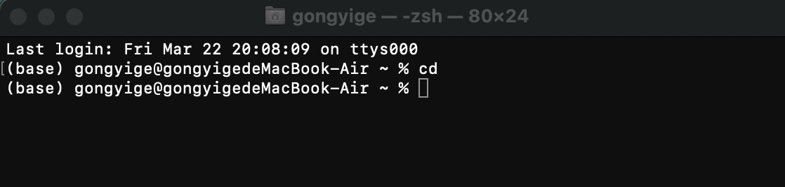
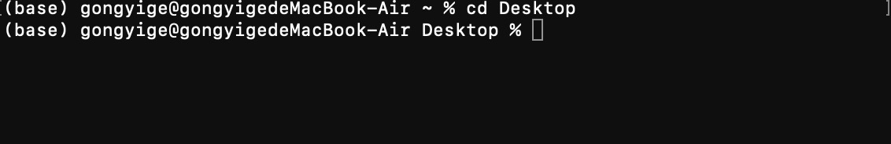
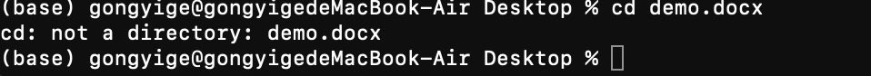
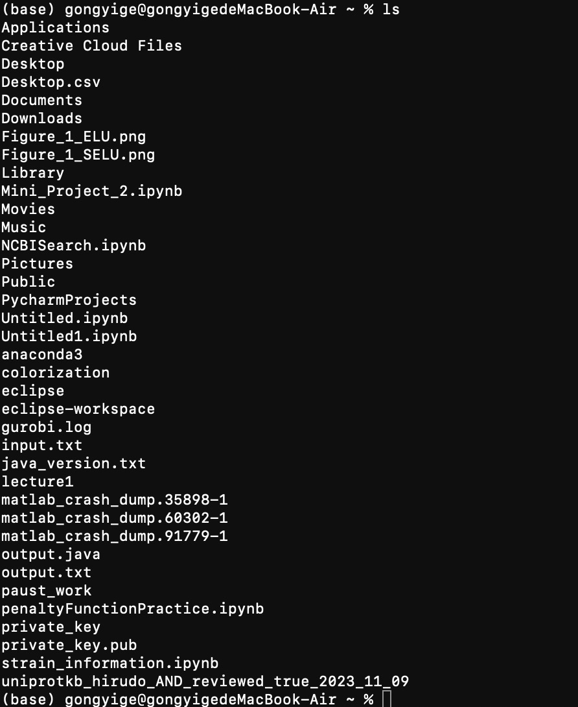
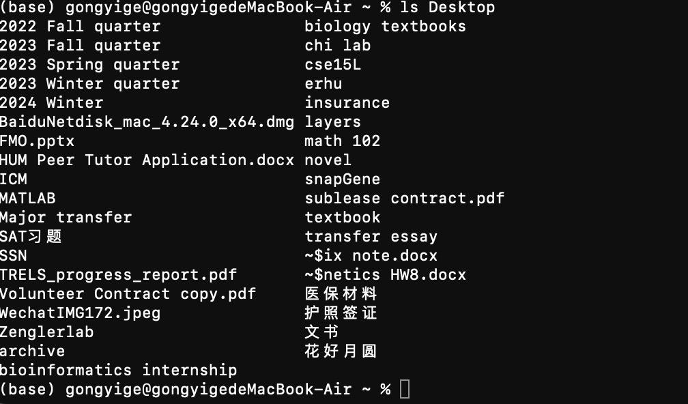
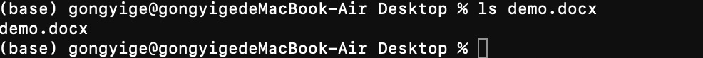
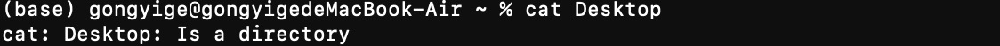
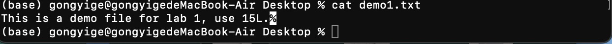

# CSE15L Lab 1 Report
## cd command

absolute path: `/Users/gongyige`

absolute path: `/Users/gongyige`

absolute path: `/Users/gongyige/Desktop`

---

## ls command

absolute path: `/Users/gongyige`

absolute path: `/Users/gongyige`

absolute path:`/Users/gongyige/Desktop`

---
## cat command

absolute path: `/Users/gongyige`

absolute path: `/Users/gongyige`

absolute path:`/Users/gongyige/Desktop`

